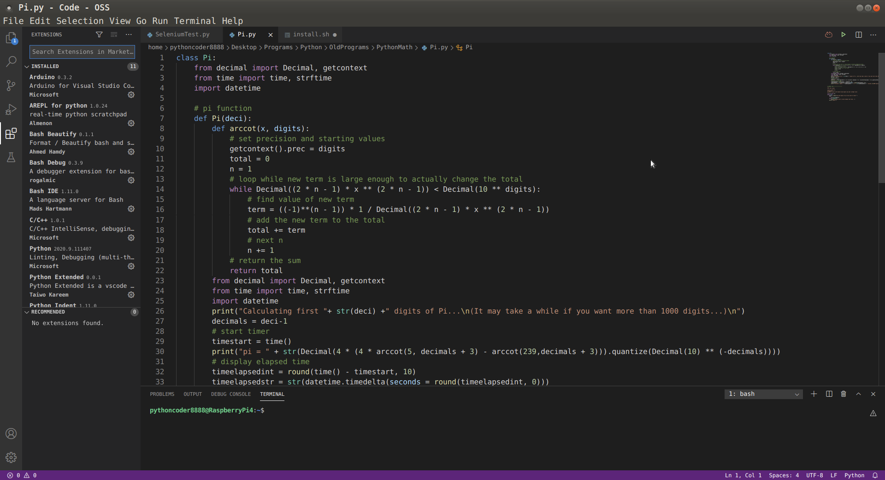

# VSCode-Raspberry-Pi

_above: A nice Python program to calculate pi, written using code-oss on Rasberry Pi 4._
## Table of Contents
* [Introduction](#introduction)
* [Prerequisites](#prerequisites)
* [Installation](#installation)
* [Credits](#credits)

## Introduction
This repository installs visual studio code (code-oss) on your Raspberry Pi 3B+ or Raspberry Pi 4 easily.\
**_Raspberry Pi 4 with at least 4GB RAM is recommended!!!_**\
I was tired of doing hours of research and trying out commands to get Visual Studio Code, and have it not work.\
So, I made this repository which makes everything easier for you!

## Prerequisites
***_All the following commands are for Ubuntu/Debian_***
* An updated system `sudo apt-get update && sudo apt-get upgrade -y`
* Git: `sudo apt-get install git`

## Installation
All you have to do to install code-oss is to:
1. Open your terminal by pressing `Ctrl` + `Alt` + `T`  on your keyboard.
2. Clone this repository: `git clone https://github.com/BennyThePythonCoder/VSCode-Raspberry-Pi.git`
3. Open the file directory: `cd VSCode*`
4. Run the script: `sudo sh install.sh` _Note: You may be promted to enter your password for the script to work._
5. Reboot `sudo reboot now`
6. To run VSCode, just type `code-oss` in your terminal or find "Code-OSS" in your application menu.

## Credits
#### Many thanks to:
* https://code.headmelted.com/
* https://github.com/futurejones/code-oss-aarch64
* https://packagecloud.io/swift-arm/vscode
* https://www.makeuseof.com/tag/raspberry-pi-code-oss/
